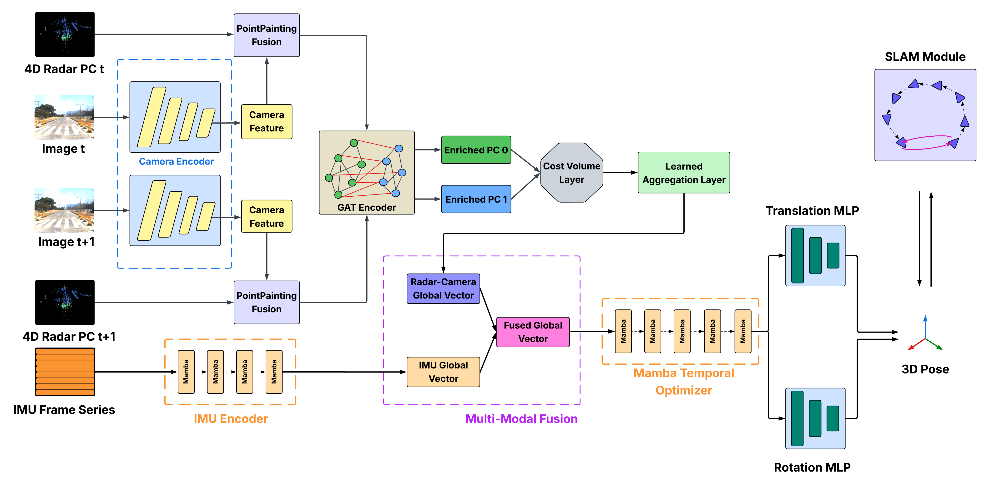
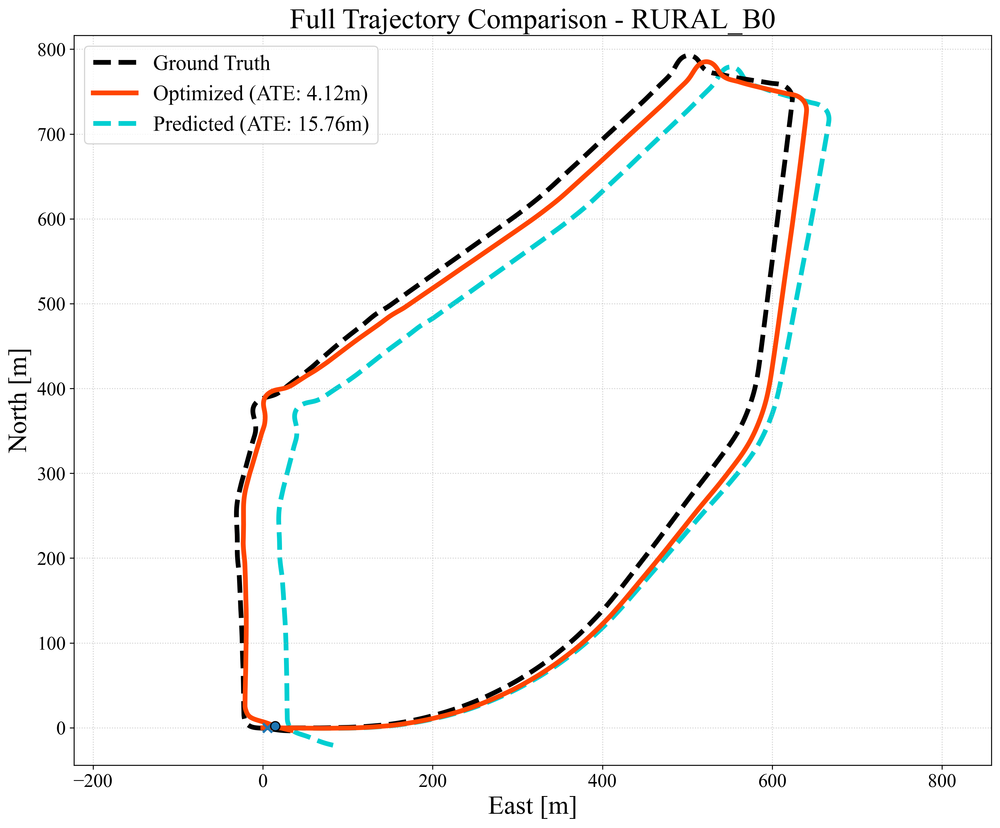
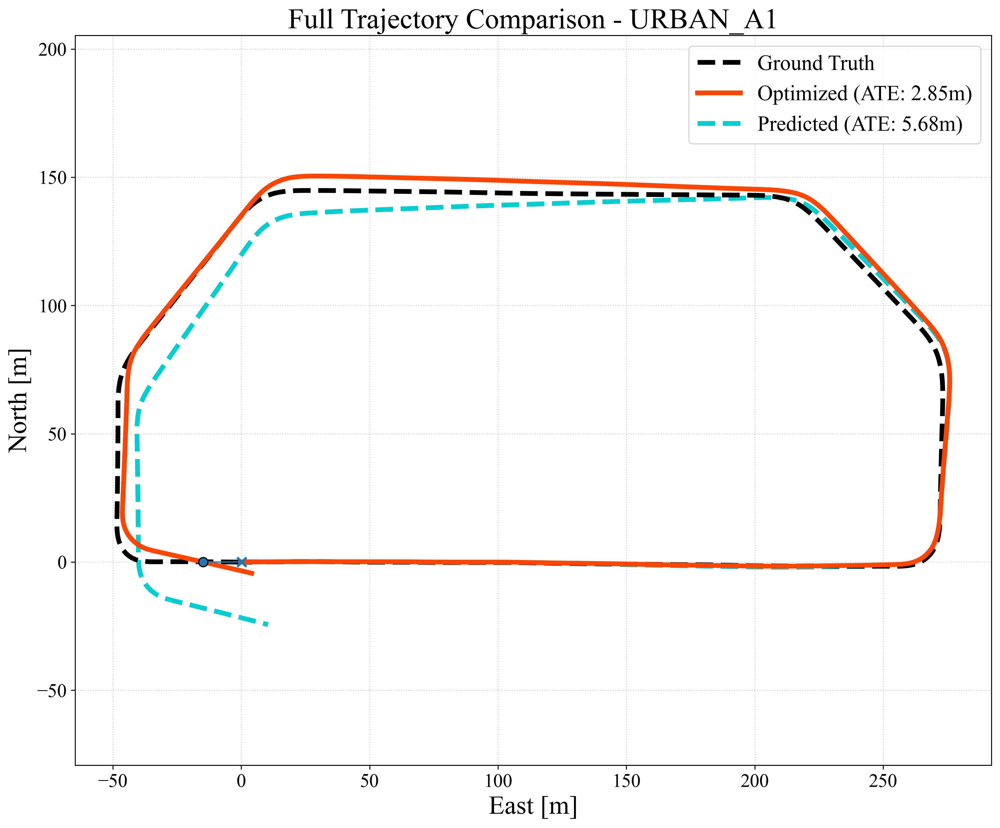
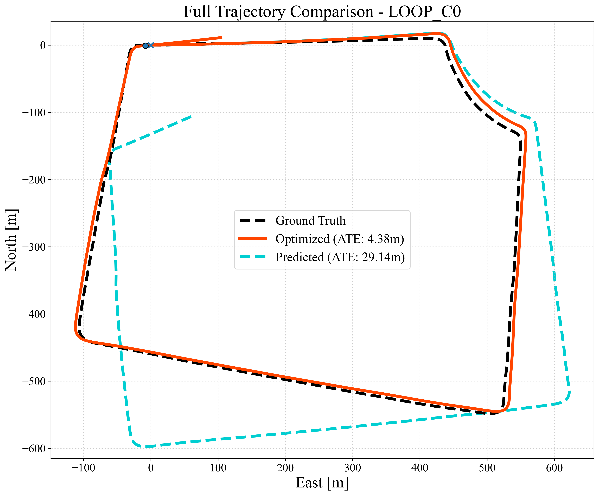
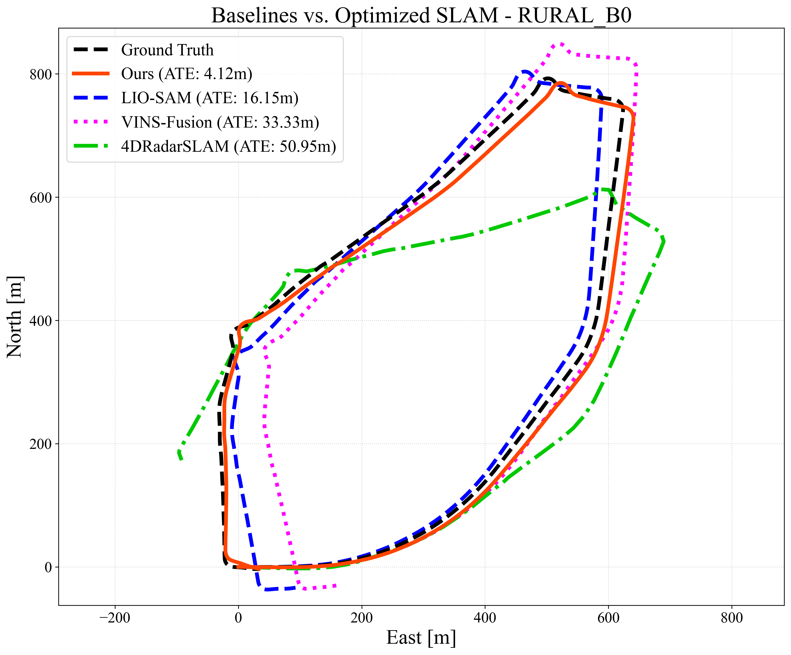
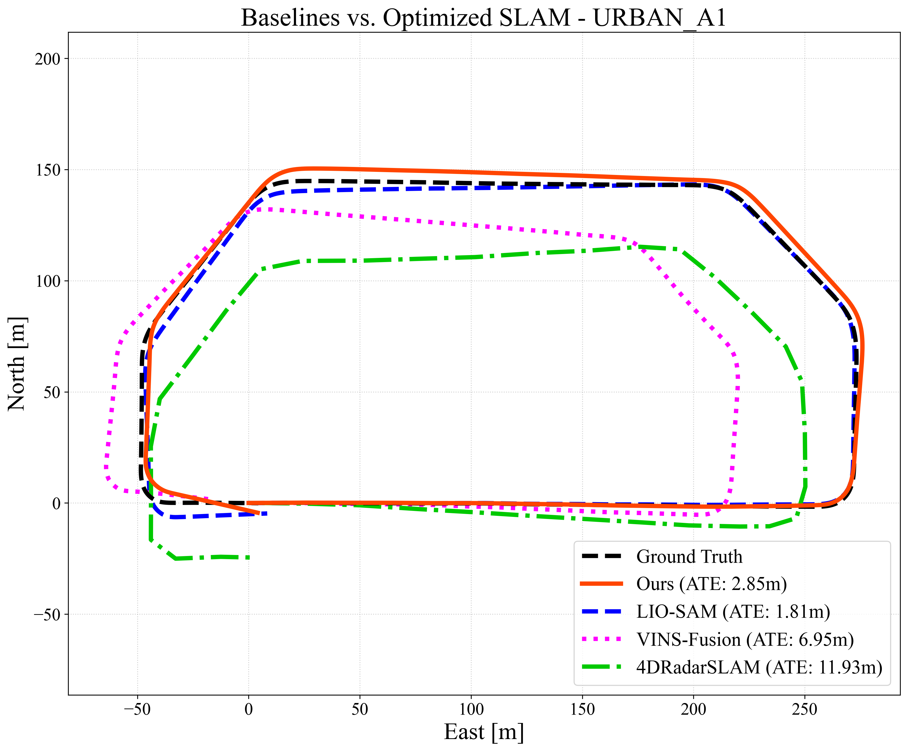
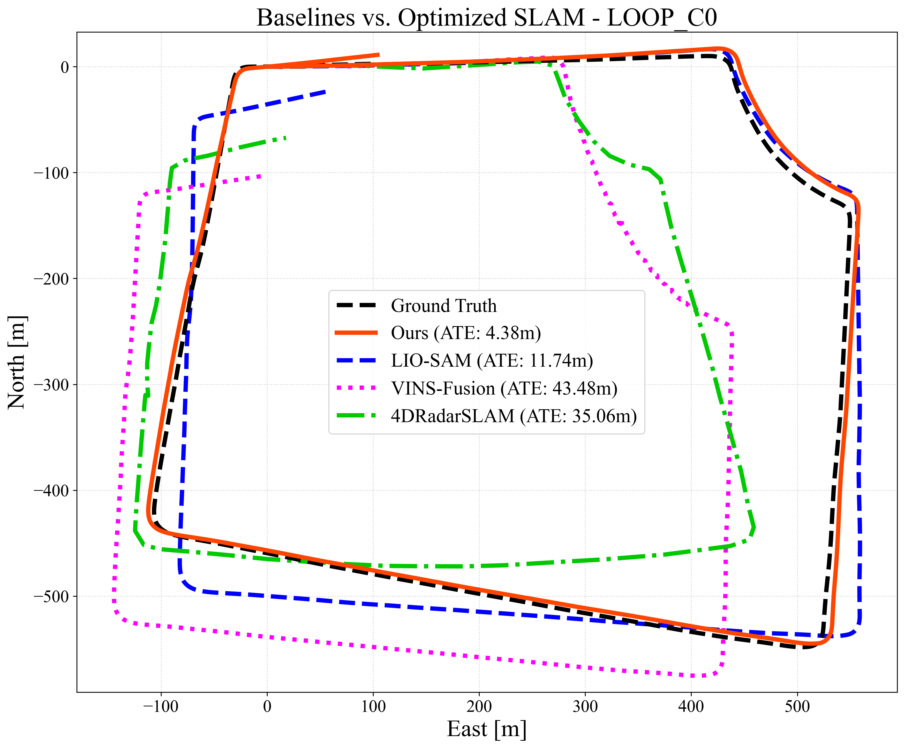

<div align="center">
  <h1>🚀 GMaP-SLAM</h1>
  <h3>Multi-Relational Graph Fusion for 4D Radar-Camera-IMU SLAM</h3>
  
  
  
</div>

<p align="center">
  <strong>GMaP-SLAM</strong> is a multimodal SLAM framework designed for autonomous driving. It fuses 4D imaging radar, camera, and IMU data using a Mamba-based inertial encoder and a multi-relational Graph Attention Network (GAT). It combines a robust learning-based front-end with a generalized ICP (GICP) and GTSAM-powered geometric pose-graph back-end.
</p>

<p align="center">
  
</p>

---

## 🧠 Key Technical Innovations

Extensively detailed in our methodology, GMaP-SLAM introduces several novel components to the deep learning odometry and SLAM literature:

* **PointPainting Fusion:** Combines raw sparse 4D radar point clouds with dense semantic features extracted from an EfficientNetV2-S visual encoder, projecting them onto a unified coordinate plane.
* **Multi-Relational Graph Attention Network (GAT):** Moves beyond simple Euclidean-distance graphs by constructing a heterogeneous graph powered by three edge types: *Spatial* (geometric context), *Dynamic* (Doppler-guided kinematics), and *Semantic* (Visual feature similarity).
* **Enhanced Hybrid Cost Volume:** A learnable point-to-patch cost layer that calculates motion vectors by dynamically balancing geometric distance with feature-based semantic consistency. This mitigates the severe positional noise inherent to 4D radar.
* **Bidirectional Mamba IMU Encoder:** Exploits the linear $\mathcal{O}(S)$ complexity of Structured State Space Models (Mamba) to efficiently process high-frequency inertial sequences bidirectionally, overcoming the quadratic cost of Transformers and the memory-forgetting of standard RNNs.
* **Adaptive Multi-Modal Gating:** Employs Raci-Net-inspired self-attention and cross-attention filtering. The network learns to dynamically modulate "trust" between exteroceptive (Camera-Radar) and proprioceptive (IMU) streams based on the current scene condition (e.g., ignoring noisy gyroscopes or visually degraded scenes).
* **Funnel-based SLAM Loop Closure:** A robust multi-modal place recognition module that implements a three-stage funnel (Temporal/Stationary filtering $\rightarrow$ Multi-Modal Voting via Scan Context & Visual Cosine Similarity $\rightarrow$ OR-Logic rigorous geometric verification via Generalized ICP) before feeding constraints to a GTSAM pose graph with a dynamic noise model.

---

## 📊 Qualitative Results

The following results demonstrate the system's performance on the MSC-RAD4R benchmark.

### Odometry vs. Optimized Trajectory (Plot 3)
The following plots demonstrate how the global pose-graph optimization (red) corrects the accumulated drift of the open-loop neural odometry prediction (blue).

<p align="center">
  
   
  
</p>

### Baseline Comparisons (Plot 4)
GMaP-SLAM evaluated against LiDAR-Inertial (LIO-SAM) and Visual-Inertial (VINS-Fusion) baselines on rural, urban, and loop-closure sequences.

<p align="center">
  
   
  
</p>

---

## 🎯 Ground Truth Reconstruction for Training

To train the neural front-end to predict highly accurate 6-DoF relative poses, a reliable Ground Truth (GT) is strictly required. In the MSC-RAD4R dataset framework, the Ground Truth used for supervising GMaP-SLAM was reconstructed via **High-Precision RTK-GPS / INS Coupling**:

1. **RTK-GNSS + INS Fusion**: The vehicle is equipped with an RTK (Real-Time Kinematic) GNSS receiver coupled with a high-end tactical-grade Inertial Navigation System (INS).
2. **Offline Smoothing**: Rather than relying on real-time estimates, the trajectory is processed offline using a forward-backward smoothing algorithm (e.g., Rauch-Tung-Striebel smoother) over the RTK and INS data. This yields centimeter-level translation accuracy and highly accurate roll, pitch, and yaw orientations.
3. **Reference Frame Alignment**: The smoothed high-frequency vehicle poses are temporally synchronized with the 4D Radar and Camera timestamps. The poses are then transformed into a unified local Euclidean frame (e.g., ENU - East North Up) which serves as the absolute mathematical reference during the PyTorch Smooth-L1 and Quaternion Cosine Loss calculation.

---

## 📂 Codebase Guide

The repository is modularized according to the standard Deep Learning and Robotics engineering principles.

### 1. `odometry/` (Front-End & Deep Learning)
Contains the PyTorch code for training and running the multimodal neural odometry.
* **Models**: 
  * `cost_volume.py`: Implements the Point-to-Patch and Patch-to-Patch geometric cost volumes.
  * `graph_attention.py`: The Multi-Relational GAT encoding spatial, visual, and Doppler edges.
  * `imu_encoder.py`: The bidirectional Mamba-based IMU state-space module.
  * `multimodal_fusion.py`: The core fusion network gating visual, radar, and inertial features.
* **Data & Utils**: `dataset_multimodal.py`, `extract_rosbag_data.py`, `losses.py`.
* **Training & Eval**: `train_multimodal_amp.py`, `evaluate_multimodal.py`.

### 2. `loop_closure/` (Back-End & Optimization)
Contains the hybrid Python/C++ pipeline for loop-closure detection and GTSAM factor graph optimization.
* **`cpp_src/` & `extern/`**: High-performance C++ backend (bound via `pybind11`) that computes GICP fitness, Scan Context, and spatial filtering.
* **`python_src/`**:
  * `run_backend_pipeline.py`: The main script that takes the neural front-end poses, searches for loops using the C++ backend, constructs the GTSAM graph, and performs Levenberg-Marquardt optimization.
  * `loop_detector_frontend.py`: Python wrapper managing heuristics and similarity thresholds.

---

## ⚙️ Installation & Build

1. **Clone the repository and its submodules:**
```bash
git clone --recursive https://github.com/riccardofrasson/GMaP-SLAM.git
cd GMaP-SLAM
```

2. **Install Python dependencies:**
```bash
pip install -r requirements.txt
```
*Note: PointNet++ custom CUDA operations (`pointnet2_ops`) must be compiled manually if not available in your environment.*

3. **Build the C++ Loop Detector module:**
The Loop Closure module uses a high-performance C++ backend. You must compile it locally before running the SLAM pipeline.
```bash
# Ensure you have CMake and standard build tools installed
chmod +x build_loop_detector.sh
./build_loop_detector.sh
```

---

## 🚀 Running the Pipeline

To run the full SLAM pipeline (Neural Odometry + C++ Loop Closure + GTSAM Optimization) on a sequence and generate the IEEE-compliant evaluation plots:

```bash
cd loop_closure/python_src
python3 run_backend_pipeline.py \
  --sequence_name RURAL_B0 \
  --bag_start_time 1677223716.03 \
  --use_gps_filter \
  --save_plot \
  --liosam_csv <path_to_liosam_csv> \
  --vins_csv <path_to_vins_csv> \
  --fdr_csv <path_to_4dr_csv>
```

> **Note on timestamps:** `bag_start_time` is required to accurately temporally align the ROS baseline CSVs (LIO-SAM, VINS) with our evaluation loops.
